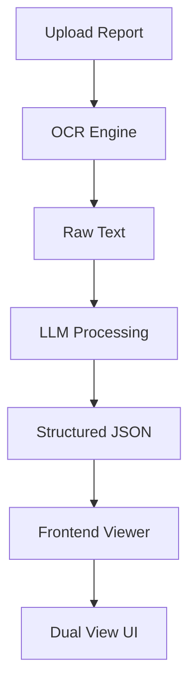

# Patient Report Simplifier (Explainable Report Viewer)

## 1. Overview
A lightweight, explainable medical report viewer that converts raw diagnostic reports into structured, prioritized insights with full traceability back to the source text.

**Core value**: Highlight what matters, explain why, and show exactly where it came from.

**Primary user**: Patient (non-medical)
**Secondary users**: Doctors, nurses (read-only consumption)

---

## 2. Problem Statement
Patients receive diagnostic reports filled with jargon and scattered data. They struggle to identify abnormal values, understand their implications, and trust AI-generated summaries due to lack of transparency.

---

## 3. Goals (Hackathon Scope)
- Extract structured data from messy reports
- Identify and rank abnormal findings
- Provide simple, contextual explanations
- Ensure every AI insight is traceable to source text
- Deliver a clean, low cognitive load UI

---

## 4. Non-Goals
- No longitudinal tracking (single report only)
- No doctor workflow tools
- No conversational chat interface
- No definitive diagnosis
- No advanced clinical recommendations

---

## 5. Core Principles
1. **Traceability first**: Every insight must link back to source text
2. **Clarity over completeness**: Show only what matters
3. **No hallucination risk**: Conservative interpretation
4. **Low cognitive load**: Minimal text, structured output

---

## 6. User Flow
1. Upload report (PDF/image/text)
2. OCR extraction (instant feedback)
3. View A: Raw report with highlights
4. View B: AI interpreted insights
5. Click any insight → see source linkage

---

## 7. Features

### 7.1 Upload & Ingestion
- Accept PDF, image, or text
- OCR extraction
- Immediate display of extracted text

### 7.2 Dual View Interface

#### View A: Original Report
- Raw OCR text
- Highlight:
  - Test names
  - Values
  - Reference ranges

#### View B: AI Interpreted View
Structured panels:

---

### Panel 1: Key Findings
- Ranked abnormal values (max 5)
- Priority levels: High / Medium / Low

---

### Panel 2: Explanation
For each finding:
- What the test is
- Why it is abnormal
- Simple explanation

---

### Panel 3: Context
- Possible implications (non-diagnostic)
- Conservative language

---

### 7.3 Interactive Traceability
- Click a finding → highlight source text
- Show exact snippet used for inference

---

### 7.4 Confidence & Disclaimer
- Confidence score (0–1)
- “AI-generated interpretation” label
- “Based on single report” disclaimer

---

## 8. Data Schema (LLM Output)

```json
{
  "tests": [
    {
      "name": "Hemoglobin",
      "value": "10.2",
      "range": "13-17",
      "status": "low",
      "priority": "high",
      "finding": "Low hemoglobin",
      "explanation": "May indicate anemia",
      "source_snippet": "Hemoglobin: 10.2 g/dL (13-17)"
    }
  ],
  "summary": "2 abnormal findings detected",
  "confidence": 0.78
}
```

---

## 9. System Architecture (High Level)



---

## 10. Technical Approach
- OCR: Tesseract or API
- LLM: Single structured prompt
- No rule engine
- String matching for highlighting
- Lightweight frontend (React or similar)

---

## 11. Prompt Strategy (Core)

Input:
- Raw OCR text

Output:
- Structured JSON
- No free text outside schema

Key instructions:
- Extract all tests with values and ranges
- Flag abnormalities
- Rank by severity
- Provide simple explanations
- Avoid definitive diagnosis

---

## 12. Demo Script (3 Minutes)
1. Upload messy report
2. Show OCR output
3. Switch to AI view
4. Highlight key findings
5. Click → show source traceability
6. Emphasize explainability

---

## 13. Success Criteria
- Works end-to-end
- Handles messy input
- Produces structured output
- Clear UI with ranked insights
- Demonstrates traceability

---

## 14. Future Scope
- Multi-report comparison
- Doctor-facing summary
- Conversational Q&A
- Personalized recommendations

---

## 15. Risks
- OCR inaccuracies
- LLM hallucination
- Misinterpretation of ranges

Mitigation:
- Show raw data
- Add disclaimers
- Keep explanations conservative

